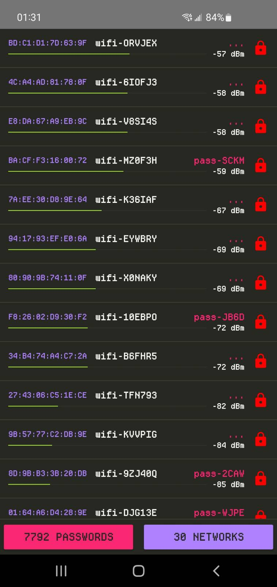
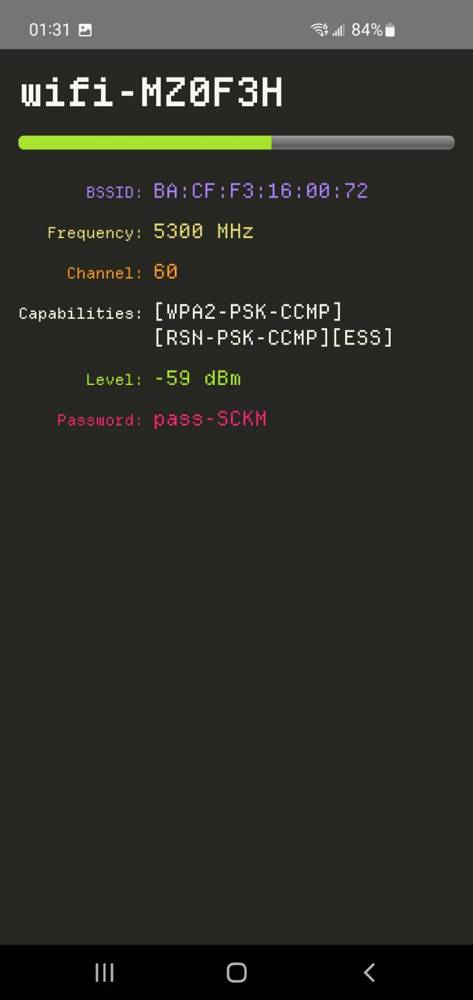

# hcx-awifi

airodump-ng clone that shows you passwords of nearby networks you have cracked with hashcat

hcx-wifi tool from [hcx-tools-extra](https://github.com/0000xFFFF/hcx-tools-extra) made as an android app

| Scanning                           | Details                            |
| ---------------------------------- | ---------------------------------- |
|  |  |

## Disclaimer

The hcx-tools-extra are intended for educational purposes only.
The author is not responsible or liable for any misuse, illegal activity, or damage caused by the use of these scripts.
Users are solely responsible for ensuring compliance with applicable laws and regulations.
